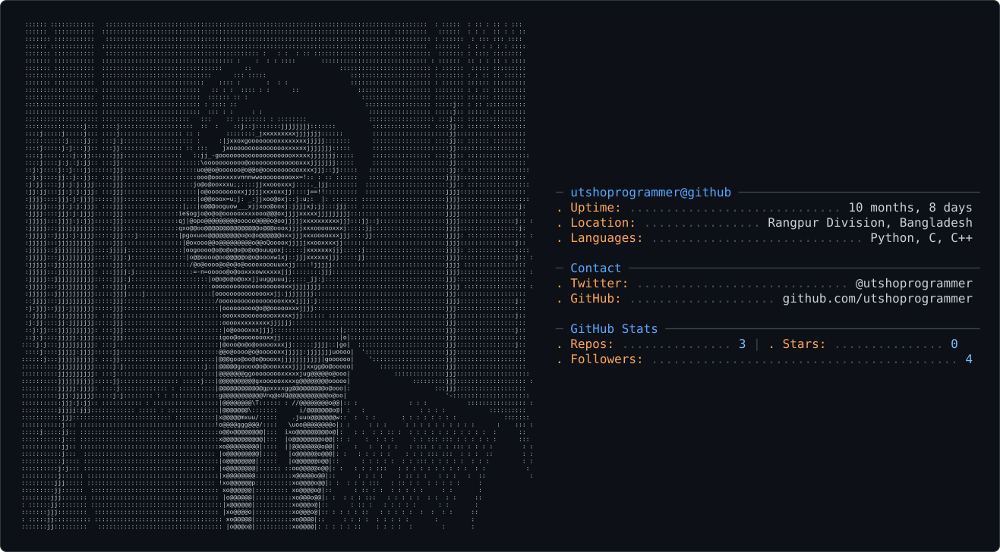

<!-- ═══════════════════════════════════════════════════════════ -->
<!--            2. CINEMATIC HEADER                             -->
<!-- ═══════════════════════════════════════════════════════════ -->

 

&nbsp;

&nbsp;

  

  

---

<picture>
  <source media="(prefers-color-scheme: dark)" srcset="dark_mode.svg" />
  <source media="(prefers-color-scheme: light)" srcset="light_mode.svg" />
  
</picture>

---

  

 

## `01 // ABOUT ME`

I'm **Utsa Kumar Roy**, a Full-Stack Software Engineer backed by a rigorous foundation in computer science fundamentals, data structures, and algorithms from Phitron.

I build production-ready, scalable web applications across the full stack—leveraging React, Next.js, TypeScript, and Tailwind CSS on the frontend, alongside robust backend architectures built with Node.js, Express.js, MongoDB, and PostgreSQL.

Beyond traditional web development, I am actively bridging core engineering principles with AI Engineering—exploring LLMs, RAG pipelines, AI agents, and intelligent application workflows, while sharpening my expertise in software architecture, system design, and performance optimization.

My objective is clear: build high-performance, maintainable, and intelligent software that solves real-world problems efficiently.

---

## `02 // Tech Stack`

  <b>Languages</b>

  

  <b>Frontend</b>

  

  <b>Backend</b>

  

  <b>Database</b>

  

  <b>DevOps & Cloud</b>

  

  <b>Tools & Environment</b>

 

---

## `03 // Competitive Programming`

<table>
<tr>

<td align="center" width="33%">

 

### Codeforces

[View Profile →](https://codeforces.com/profile/utshoprogrammer)

</td>

<td align="center" width="33%">

 

### LeetCode

[View Profile →](https://leetcode.com/u/utshoprogrammer/)

</td>

<td align="center" width="33%">

 

## CodeChef

[View Profile →](https://www.codechef.com/users/utsaprogrammer)

</td>

</tr>
</table>

 

## `04 // Codeforces Statistics`

  

## `05 // LeetCode Statistics`

Codeforces & LeetCode avatars + statistics auto-update through GitHub Actions.
See <code>.github/workflows/update-avatars.yml</code>

 

---

## `06 // CURRENTLY`

| Area        | Focus                                                       |
| ----------- | ----------------------------------------------------------- |
| `BUILDING`  | Full-stack web applications & SaaS products                 |
| `LEARNING`  | TypeScript • Next.js • PostgreSQL • System Design •FastAPI  |
| `EXPLORING` | AI Engineering • LLMs • RAG • AI Agents                     |
| `DEPLOYING` | Vercel • Docker • GitHub Actions • Cloud                    |
| `IMPROVING` | Software Architecture • Testing • Security                  |
| `GOAL`      | Becoming an AI-Powered Full-Stack Software Engineer         |

---

## `07 // Contribution Streak`

  
  

---

## `08 // Contribution Graph`
utsaprogrammer

  

---

## `09 // GitHub Profile`

  

  
  

---

## `10 // CONNECT`

<!-- ═══════════════════════════════════════════════════════════ -->
<!--                    CONNECT SECTION                        -->
<!-- ═══════════════════════════════════════════════════════════ -->

<h3><code>Socials</code></h3>

 

&nbsp;

&nbsp;

  

&nbsp;

&nbsp;

  

<table border="0" cellpadding="0" cellspacing="0">
<tr>

<td align="center" valign="middle">

</td>
</tr>
</table>

 

---

