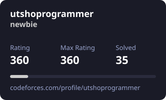

 

  

 

## 👨‍💻 About Me

> **CSE Student from Rangpur, Bangladesh** — focused on strengthening problem-solving skills through **DSA and Competitive Programming**, while exploring **backend and web development**.

- 🔭 Currently solving problems on **Codeforces & LeetCode**
- 🌱 Deepening my understanding of **Data Structures & Algorithms with C++**
- 🤝 Open to collaborate on **backend development & competitive programming projects**
- 📫 **Email:** [habibprogrammerbd@gmail.com](mailto:habibprogrammerbd@gmail.com)
- 🌐 **Portfolio:** [my-portfolio-five-pearl-14.vercel.app](https://my-portfolio-five-pearl-14.vercel.app/)

 

---

## 🛠️ Tech Stack

  <b>Languages</b>

  

  <b>Web Development</b>

  

  <b>Tools & Environment</b>

 

---

## 🏆 Competitive Programming

<table>
<tr>

<td align="center" width="33%">

 

### Codeforces

[View Profile →](https://codeforces.com/profile/Habib101)

</td>

<td align="center" width="33%">

 

### LeetCode

[View Profile →](https://leetcode.com/u/habibprogrammerbd/)

</td>

<td align="center" width="33%">

 

## CodeChef

 

[View Profile →](https://www.codechef.com/users/ahosan_habib)

</td>

</tr>
</table>

 

### Codeforces Statistics

  

### LeetCode Statistics

Codeforces & LeetCode avatars + statistics auto-update through GitHub Actions.
See <code>.github/workflows/update-avatars.yml</code>

 

---

## 📊 GitHub

 

---

## 🤝 Connect With Me

 

---

<a href="https://github.com/habibprogrammerbd">GitHub</a>
&nbsp;&nbsp;•&nbsp;&nbsp;
<a href="https://codeforces.com/profile/Habib101">Codeforces</a>
&nbsp;&nbsp;•&nbsp;&nbsp;
<a href="https://leetcode.com/u/habibprogrammerbd/">LeetCode</a>
&nbsp;&nbsp;•&nbsp;&nbsp;
<a href="https://www.codechef.com/users/ahosan_habib">CodeChef</a>

  

Built with curiosity, consistency, and code.

